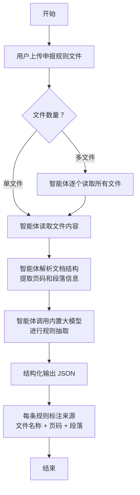

## 何时使用

当你需要处理基金项目申报相关的政策文件、申报指南、评审办法等文档，并从中提取关键规则信息时使用本技能。

**用户只需上传文件，智能体自动完成所有处理，无需配置任何 API。**

典型场景：
- 收到多个 PDF/Word/Excel 格式的申报文件，需要快速了解申请要求
- 需要整理申报规则，制作对比表格或检查清单
- 需要追溯某条规则的原始出处（哪个文件的哪一页）

## 输入要求

### 必需文件
- **申报规则文件**：支持以下格式
  - PDF 文档（.pdf）
  - Word 文档（.docx、.doc）
  - Excel 表格（.xlsx、.xls）
  - 纯文本（.txt）
  - Markdown（.md）
- 可上传单个文件，也可上传多个文件批量处理

### 可选参数
- **抽取重点**：指定重点关注哪类规则（申请资格/审查标准/时间节点/全部）
- **输出格式**：JSON/Markdown 表格（默认 JSON）

## 执行流程



### 步骤说明

1. **上传文件**
   - 将申报文件放入工作区或直接上传给智能体
   - 支持批量上传多个文件

2. **文件解析**（工具自动完成）
   - PDF：提取文本内容，保留页码信息
   - Word/Excel：使用对应解析库读取
   - 文本/Markdown：直接读取内容
   - 记录每个段落的来源（文件名、页码、章节）

3. **规则抽取**（智能体自动完成）
   - 智能体调用工具解析文档并生成抽取提示词
   - 智能体利用**内置大模型**分析文档内容（无需用户配置 API）
   - 抽取以下类型的规则：
     - **申请资格条件**：申请人资质、项目类型、资金额度、配套要求等
     - **审查标准**：评审流程、评分标准、否决条件、材料要求等
     - **时间节点**：申报截止、评审时间、公示时间、立项时间等
     - **其他重要信息**：联系方式、咨询渠道、注意事项等

4. **来源标注**（智能体自动完成）
   - 每条抽取的规则自动标注来源
   - 格式：`{文件名称}` - 第 `{页码}` 页 - `{章节/段落}`

5. **结构化输出**（智能体自动完成）
   - 输出为 JSON 格式，包含：
     - 规则分类
     - 规则内容
     - 来源信息

## 输出要求

### JSON 输出示例

```json
{
  "文件信息": {
    "文件名": "2026 年度科技创新基金申报指南.pdf",
    "总页数": 25,
    "解析时间": "2026-06-23 10:30:00"
  },
  "抽取结果": {
    "申请资格": [
      {
        "规则内容": "申报单位须为在中华人民共和国境内注册的高等院校、科研院所或高新技术企业",
        "来源": {
          "文件": "2026 年度科技创新基金申报指南.pdf",
          "页码": 3,
          "章节": "第二章 申报条件"
        },
        "置信度": 0.95
      }
    ],
    "审查标准": [
      {
        "规则内容": "项目评审采用百分制，其中技术创新性占 40 分、团队实力占 30 分、实施方案占 20 分、预算合理性占 10 分",
        "来源": {
          "文件": "2026 年度科技创新基金申报指南.pdf",
          "页码": 12,
          "章节": "第四章 评审标准"
        },
        "置信度": 0.92
      }
    ],
    "时间节点": [
      {
        "规则内容": "申报截止时间为 2026 年 9 月 30 日 17:00，逾期不予受理",
        "来源": {
          "文件": "2026 年度科技创新基金申报指南.pdf",
          "页码": 5,
          "章节": "第三章 申报流程"
        },
        "置信度": 0.98
      }
    ]
  },
  "处理统计": {
    "总规则数": 28,
    "申请资格类": 8,
    "审查标准类": 12,
    "时间节点类": 5,
    "其他": 3
  }
}
```

## 验证方式

1. **完整性检查**
   - 确认所有上传的文件都被解析
   - 检查 JSON 输出是否包含所有必填字段

2. **准确性验证**
   - 随机抽取几条规则，对照原文验证来源标注是否正确
   - 检查规则内容是否与原文意思一致

3. **来源追溯**
   - 根据输出中的来源信息，能够定位到原文的具体位置
   - 页码和章节信息准确无误

## 注意事项

- **文件质量**：扫描件 PDF 可能需要 OCR 处理，清晰度影响识别准确率
- **批量处理**：多个文件时，智能体会分别处理后合并结果
- **隐私保护**：涉及敏感信息的文件，请确认使用环境的安全性
